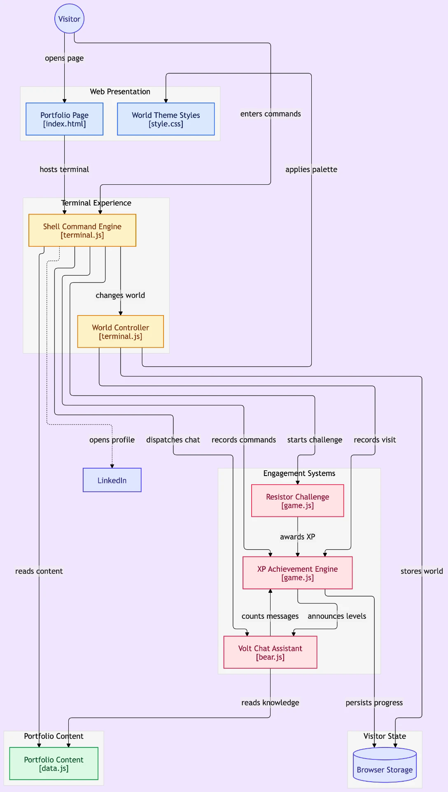

# Zack to the Future

An interactive arcade time-machine portfolio for **Zack Woodel**, an Electrical Engineering student and researcher at Texas Tech University. Instead of presenting a résumé as a static document, the site turns Zack's work in electronics, quantum materials, semiconductors, power systems, and machine learning into an explorable science-fiction console.

## Experience

Visitors select a destination, watch a destination-specific warp sequence, and enter one of three portfolio eras:

- **1985 — Neon Synthwave Workbench:** electronics fundamentals and a resistor color-code challenge.
- **2026 — Texas Tech Research Cleanroom:** present-day semiconductor and quantum-materials work with a spin-alignment puzzle.
- **3026 — Orbital Research Lab:** machine learning and future-facing engineering through a neural-network memory game.

A multiverse radar also reveals three hidden worlds: an abyssal research station, gaslamp London, and a galactic fleet battle. Each has its own visual system, ambient sound, and minigame. Completing challenges awards XP, ranks, badges, high scores, and secret dossier entries. Volt, the lab-assistant bear, supplies contextual dialogue and hints, while randomized Space Red Raider encounters turn portfolio knowledge into a retry-friendly quiz.

## System design

The diagram below was created during the initial design process. Its original terminal-oriented labels became the architectural foundation for the finished React application.



The final implementation maps those ideas as follows:

- **Web presentation** → file-based TanStack routes and reusable React page shells.
- **Command engine** → direct, keyboard, touch, and warp-code interactions.
- **World controller** → `WarpProvider`, which coordinates transitions, route changes, sound, and encounters.
- **Engagement systems** → six isolated minigames with a common score-to-progression contract.
- **XP engine** → `ProgressProvider`, the single source of truth for ranks, badges, visits, unlocks, and high scores.
- **Volt assistant** → a context-aware React component whose dialogue and costume change by destination.
- **Portfolio content** → typed data modules separated from rendering logic.
- **Visitor state** → versioned browser storage, restored only after hydration to keep server and client rendering consistent.

## Technical architecture

```text
TanStack routes
    └── ThemeProvider
        └── ProgressProvider
            └── WarpProvider
                └── AppFrame
                    ├── Console / era / world views
                    ├── Minigames
                    ├── Dossier and holo-gallery
                    ├── Volt assistant
                    └── Status, audio, and mobile controls
```

### Key implementation decisions

- **Routing and metadata:** TanStack Start supplies typed, shareable routes for `/`, three `/era/*` pages, and three `/world/*` pages. Every content route defines its own search and social metadata.
- **State model:** React Context centralizes progression. Actions such as `registerJump`, `recordScore`, and `unlockWorld` update a versioned `localStorage` record, so progress survives reloads without requiring an account.
- **Warp pipeline:** A target map binds each era or world to a route and synthesized sound. A guarded 1.8-second transition prevents duplicate navigation, then may schedule a Red Raider encounter.
- **Audio synthesis:** The Web Audio API generates oscillators, filtered noise, envelopes, alerts, and ambient beds at runtime. Audio is mute-aware and starts only after user interaction to respect browser autoplay rules.
- **Visual system:** Tailwind CSS v4 is backed by semantic OKLCH tokens. Each era and world overrides the same color roles rather than hardcoding styles throughout components.
- **Themes:** `ThemeProvider` switches between the luminous **Cosmic Galaxy** and high-contrast **Clean Lab Light** palettes and remembers the choice locally.
- **Canvas performance:** The starfield uses viewport-dependent particle counts and a capped pixel ratio. Animation pauses when the tab is hidden or a large dialog is open.
- **Input design:** Desktop shortcuts coexist with visible controls. Touch targets, sliders, swipe gestures, a mobile action dock, and safe-area spacing keep every core action usable without a keyboard.
- **Accessibility:** Dialog labels, descriptive controls, keyboard navigation, reduced-motion handling, semantic contrast tokens, and non-blocking quiz retries are built into the interaction model.

## Design process

1. **Translate the résumé into a system.** The early diagram separated presentation, commands, world changes, engagement, content, and persistence. This prevented the arcade concept from obscuring the portfolio itself.
2. **Prototype the interaction loop.** The core loop became: choose a destination → warp → explore work → complete a challenge → earn progression → reveal more detail.
3. **Build one reusable grammar.** Shared shells, panels, game contracts, state actions, and theme tokens allow every destination to feel different without becoming a separate application.
4. **Refine the art direction.** The first heavy CRT treatment evolved into translucent scientific instruments over a violet/cyan galaxy, with a cleanroom-light alternative. Scanlines and glow remain as accents rather than reducing readability.
5. **Design mobile as a control surface.** Dense cockpit layouts collapse into single-column modules, while the floating dock keeps Dossier, Gallery, Time Circuits, and Radar within thumb reach.
6. **Optimize after interaction testing.** Background work pauses behind overlays, particle density scales by device, audio is gesture-gated, and gallery/minigame interactions support touch as well as keys.

## Project structure

```text
src/
├── routes/                 # Typed console, era, and secret-world pages
├── components/             # Shells, overlays, gallery, dossier, Volt, controls
│   └── games/              # Self-contained interactive challenges
├── lib/
│   ├── portfolio-data.ts   # Eras, profile, ranks, badges, dossier content
│   ├── secret-worlds.ts    # Hidden destinations and coordinate codes
│   ├── progress.tsx        # Persistent progression state and actions
│   ├── warp.tsx            # Navigation and encounter orchestration
│   ├── sound.ts            # Web Audio synthesis and ambient sound
│   ├── theme.tsx           # Galaxy/lab theme state
│   └── gallery.ts          # Structured science-gallery entries
└── styles.css              # Tailwind v4 tokens, themes, and animation systems
```

## Stack

- React 19 and TypeScript
- TanStack Start and TanStack Router
- Vite
- Tailwind CSS v4
- Canvas 2D API
- Web Audio API
- Browser `localStorage`

## Run locally

```bash
npm install
npm run dev
```

Create a production build with:

```bash
npm run build
```

## Content note

Some résumé details remain intentionally marked as placeholders, including the contact email and selected research/project specifics. Replace them with verified information before treating the portfolio as final.

## Author

**Zack Woodel**  
[LinkedIn](https://www.linkedin.com/in/zackwoodel) · [GitHub](https://github.com/zackwoodel-debug/zacktothefuture)
